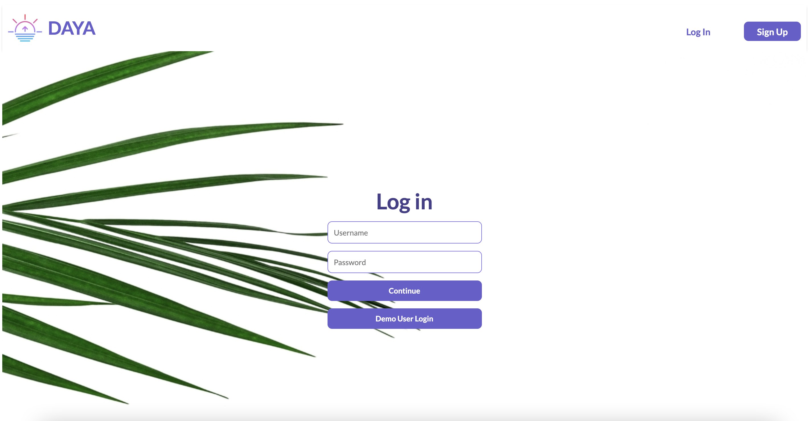
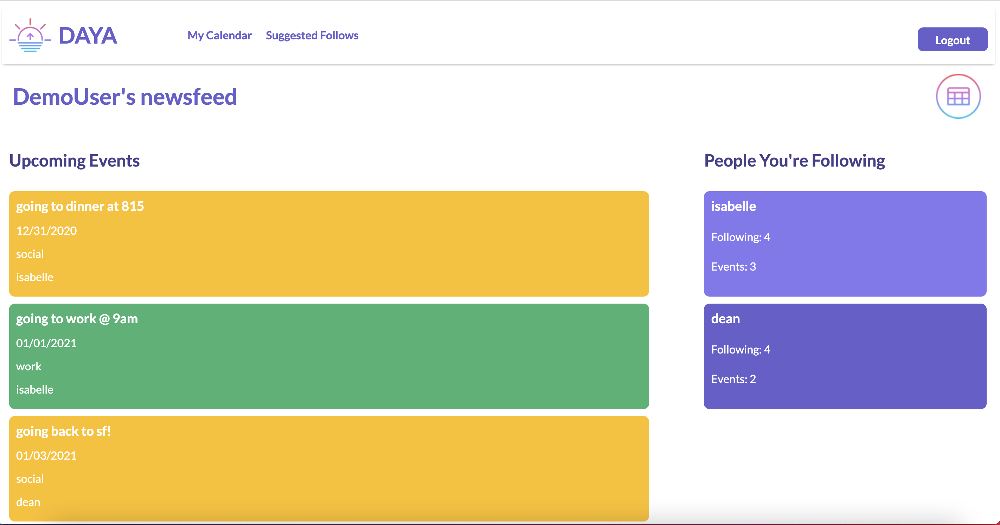
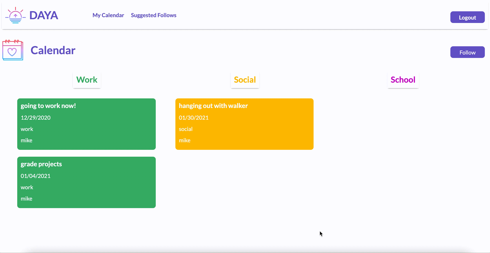
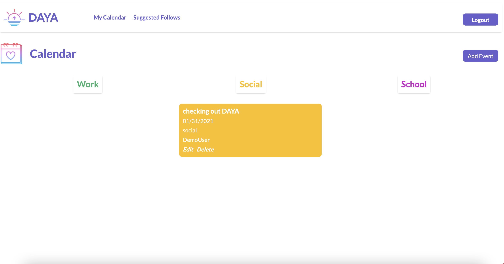
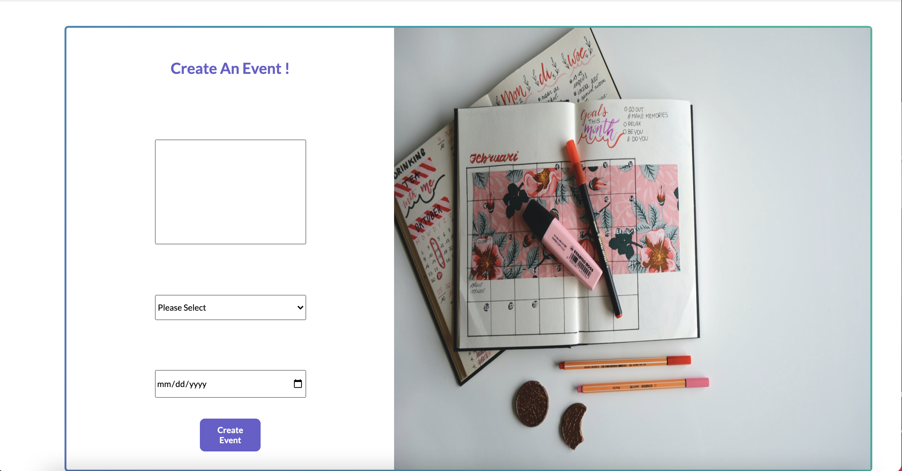
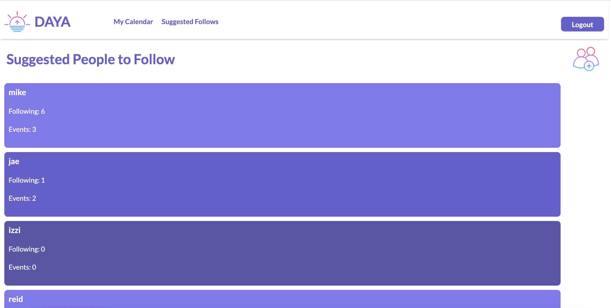

## DAYA 

DAYA is a social planner. Inspired by the desire to stay up to date on your friends calendars, DAYA allows for users to create, edit, or delete their own events, follow their friends events and view friends calendars.

Live Site: [DAYA](http://daya-mern.herokuapp.com/#/)

## Technologies Used 
* MongoDB
* Express
* React
* Redux
* Node

### Sign In/Sign Up
 * Users are able to sign in to an existing acctount, create a new account, or use demo user log in feature

### Newsfeed 
* View your friends events sorted by most recent upcoming event

### Follow/Unfollow 
* Ability fo follow and unfollow other DAYA users 

### Personal Calendar 
* Personal events 
* Ability to edit, delete or create events 

### Event CRUD 
* If logged in, ability to add, edit or delete personal events 

### Suggested Follows 
* List of all users on DAYA, including how many people they follow and how 
many events they have 

